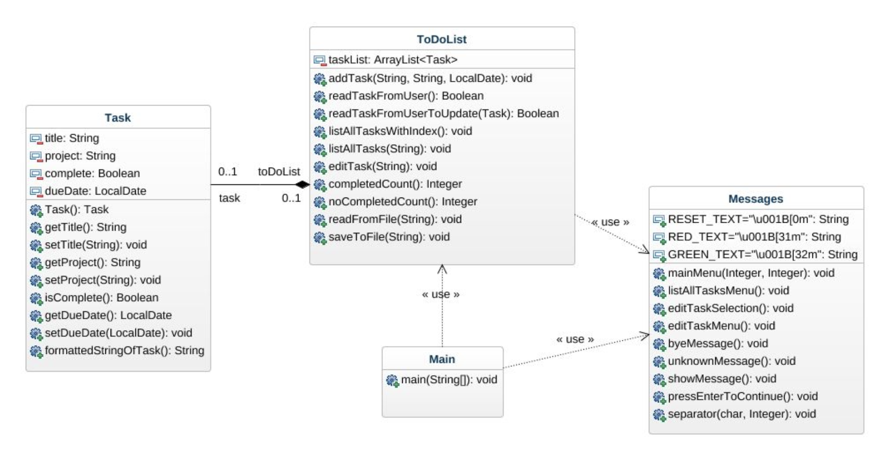
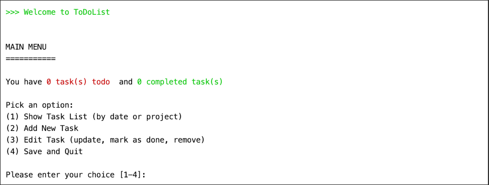
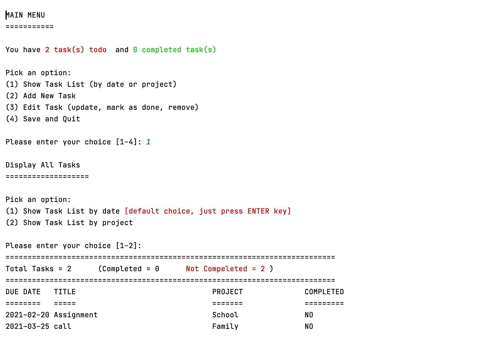
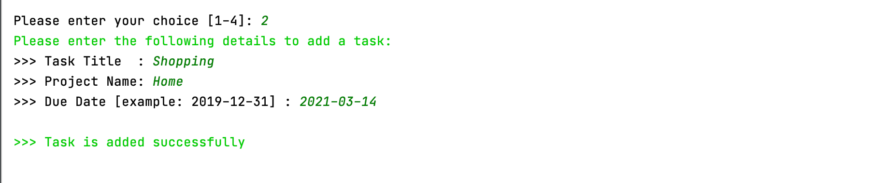
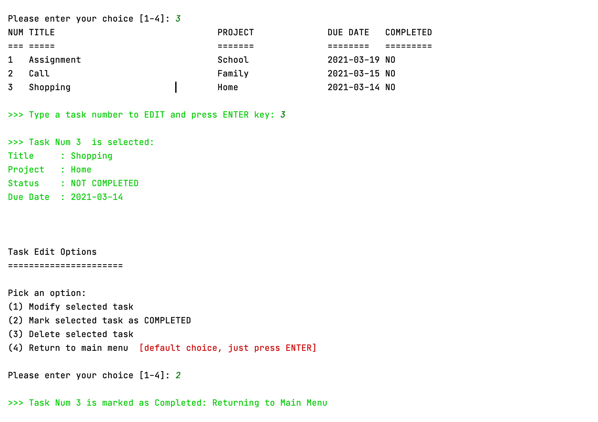
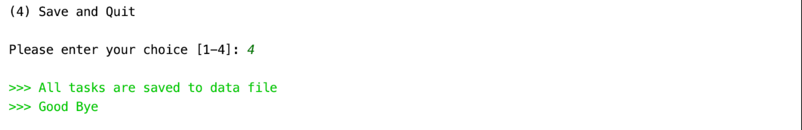

# Todo List App
An application that helps to create and manage a personal Todo List.

## Usage
This program is menu-driven. User will be presented with available options corresponding to selected menu.
User will select an option from given choices and press ENTER key to move to next step.
This program will save all tasks in the data file, therefore, next time when you open the program,
it will resume its state.

##Basic Features of the APP
* It models a task with:
    * task title
    * due date
    * completion status
    * project (if any)
* It displays a collection of tasks that can be sorted
    * by date
    * by project
* It supports the ability to
    * add tasks
    * edit tasks
    * mark a task as done and
    * remove (delete) tasks
* It supports a text-based user interface
* It loads and saves tasks list to a data file

## Class Diagram

##User Manual
####Starting the Application
When a user starts the application, main menu of the program will be displayed to
the user.

####Display list of tasks
If user types number [1] and press ENTER key, the application will display the options
for user to get list of all previously added tasks sorted by date or by project.

####Add a new task
If user types number [2] and press ENTER key, the application will prompt the user to
enter the required fields of a task to add in the task list.

####Edit an existing task (update, mark as done, remove)
If user types number [3] and press ENTER key, the application will display the list of
all previously saved tasks with index number and user has to select a task to perform
any update, to mark as done or to remove.

######## Closing the application
If user types number [4] and press ENTER key, the application will save
data of all tasks from memory and write to the data file on disk (defaut filename is `tasks.obj`).

